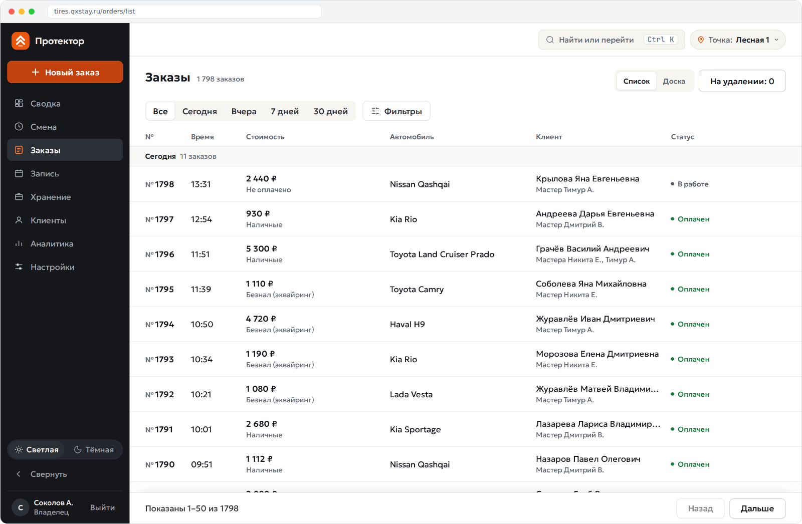

# Протектор

**Касса и учёт для сети шиномонтажей.** Заказ-наряд за минуту, чек сразу, запись и хранение шин под рукой.

> ### Сеть росла, а учёт жил в разных местах: запись в Google-таблице, смены отдельно, зарплаты мастеров в тетради, клиенты и их машины ещё где-то. Чтобы понять, сколько заработала каждая точка, всё сводили вручную. **Теперь это одна система.**

<h2 align="center"><a href="https://tires.qxstay.ru">Открыть систему »</a></h2>

Витрина на основе реального проекта. Данные вымышленные, вход в один клик.

<table>
<tr>
<td width="50%" valign="top"><b>Заказ за минуту</b> Мастер оформляет работу, клиент платит, касса сама пробивает чек.</td>
<td width="50%" valign="top"><b>Запись без звонков</b> Клиент сам выбирает свободное время на нужной точке.</td>
</tr>
<tr>
<td valign="top"><b>Шины на хранении</b> Каждый комплект лежит в своей ячейке, его легко найти.</td>
<td valign="top"><b>Зарплата считается сама</b> По сменам и работам мастеров, по правилам владельца.</td>
</tr>
</table>

**Владелец видит всю сеть:** выручку каждой точки за день и месяц. Сотрудник видит только своё.

Для разработчиков: что в коде

- `frontend/src/server/demo/generator.ts`: история сети за несколько месяцев: клиенты, машины, заказы, оплаты, записи, смены с недельным ритмом
- `frontend/src/server/demo/world.ts`: сборка мира в отдельной схеме и подмена одной транзакцией, посетитель в это время работает с прежними данными
- `frontend/src/server/demo/foundation.ts`: точки, роли, сотрудники, кассы и настройки, с которых начинается мир
- `frontend/src/server/demo/dictionaries.ts`: имена, машины, госномера и юрлица, все вымышленные
- `frontend/src/server/demo/random.ts`: генератор случайных чисел с зерном от даты: в один день одни и те же данные
- `frontend/src/server/demo/service.ts`: автопилот: утренняя сборка, тихие пересборки, сброс посетителем
- `frontend/src/server/demo/clock.ts`: сдвиг часов сервера под время мира
- `frontend/src/server/demo/workday-clock.ts`: в любое время суток на точках идёт рабочий день
- `frontend/src/server/demo/rate-limit.ts`: потолок частоты входа по адресу посетителя
- `frontend/src/components/demo/demo-banner.tsx`: полоса витрины: подсказки, ход обновления данных, свёрнутая кнопка
- `frontend/src/components/demo/scenarios-panel.tsx`: сценарии «что попробовать» и запись с телефона по QR-коду
- `frontend/src/features/kkm/components/paper-receipt.tsx`: кассовый чек, который выезжает из кассы
- `frontend/src/server/services/kkm-demo-helper.ts`: учебная касса: тот же обмен с сервером, что у помощника настоящей кассы
- `frontend/src/features/analytics/components/analytics-showcase.tsx`: аналитика: главные числа и графики
- `frontend/tests/demo/demo-unit.spec.ts`: повторяемость данных, часы мира, потолок частоты входа, периоды аналитики
- `frontend/tests/demo/demo-today.spec.ts`: план сегодняшнего дня без базы данных
- `frontend/tests/demo/demo-order-flow.spec.ts`: путь от нового заказа до чека в браузере
- `frontend/tests/demo/demo-rebuild.spec.ts`: во время пересборки заказы видны всё время, пересборка идёт одна за раз

Полный код закрыт и показывается по запросу.

Next.js 16, React 19, TypeScript, PostgreSQL, Prisma, Tailwind CSS 4, Playwright, Docker, Caddy.

Хотите такую же систему для своей сети? Напишите в [Telegram](https://t.me/qxstay).
